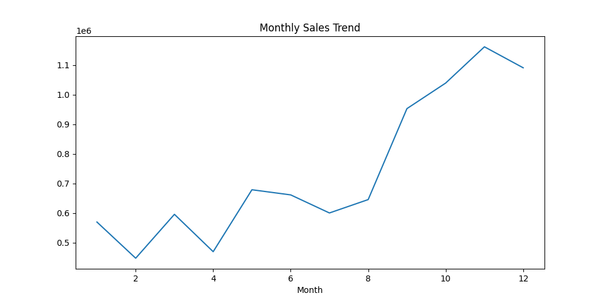
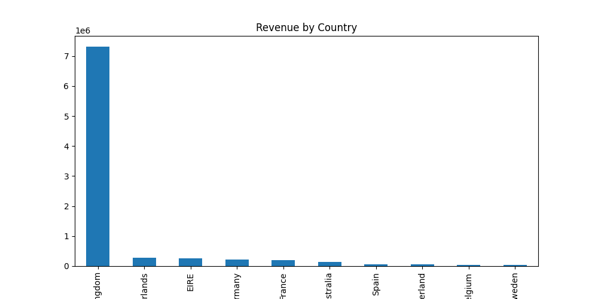
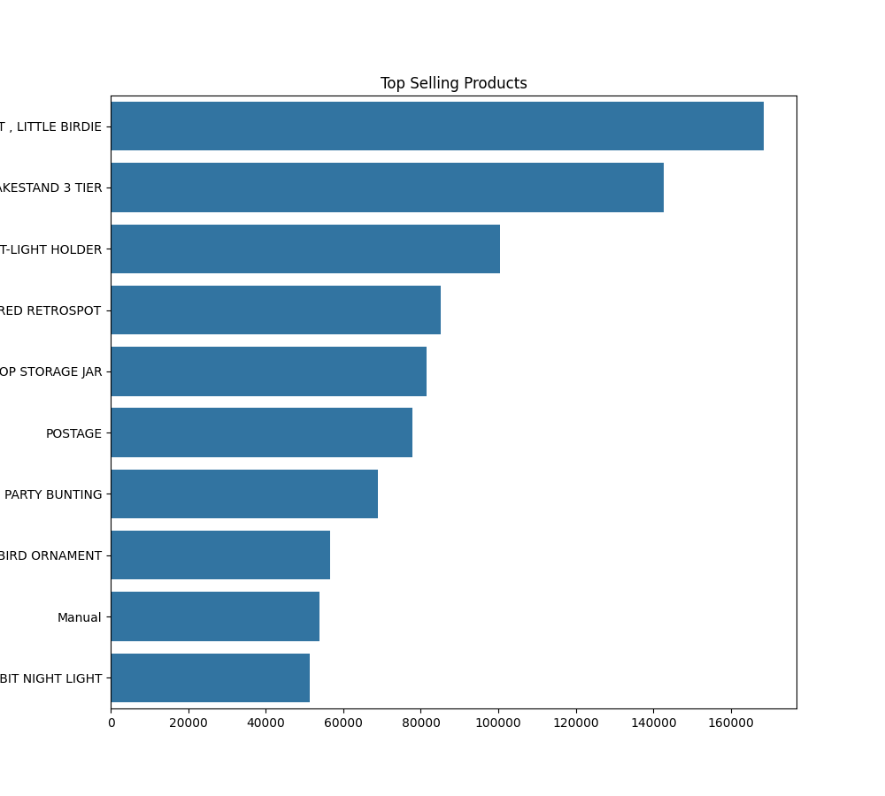

# Online Retail Sales Analysis

Exploratory analysis of 12 months of UK retail transaction data — covering revenue trends, top products, and country-level sales distribution.

---

## Dataset

**Source:** [UCI Machine Learning Repository — Online Retail Dataset](https://archive.ics.uci.edu/ml/datasets/Online+Retail)

| Attribute | Detail |
|-----------|--------|
| Period | December 2010 – December 2011 |
| Total transactions | ~541,000 rows |
| Countries | 38 countries |
| Primary market | United Kingdom |

---

## Tools

- Python (Pandas, NumPy)
- Matplotlib, Seaborn
- Jupyter Notebook

---

## Analysis Performed

- Monthly revenue trend (12-month view)
- Top products by revenue
- Revenue distribution by country
- Data cleaning — null CustomerIDs, negative quantities, cancelled orders

---

## Key Findings

### Revenue is heavily concentrated in the UK
The United Kingdom generated **£7,308,391** in revenue over the period — by far the largest single market. The remaining 37 countries combined make up the rest. This is partly a data reality (the business is UK-based) and partly worth flagging as a geographic risk: one market, one disruption.

### Q4 drives the business
Sales are flat for most of the year, then spike hard starting in September.

| Month | Revenue |
|-------|---------|
| Jan | £569,445 |
| Feb | £447,137 |
| Mar | £595,500 |
| Apr | £469,200 |
| May | £678,594 |
| Jun | £661,213 |
| Jul | £600,091 |
| Aug | £645,343 |
| Sep | £952,838 |
| Oct | £1,039,318 |
| **Nov** | **£1,161,817** ← peak |
| Dec | £1,090,906 |

November is the highest-revenue month. The Sep–Dec window accounts for a disproportionate share of annual revenue — which means inventory and logistics planning in Q3 matters a lot.

### Top 3 products by revenue

| Rank | Product | Revenue |
|------|---------|---------|
| 1 | PAPER CRAFT, LITTLE BIRDIE | £168,469 |
| 2 | REGENCY CAKESTAND 3 TIER | £142,592 |
| 3 | WHITE HANGING HEART T-LIGHT HOLDER | £100,448 |

All three are gift and home décor items — consistent with a business that peaks around the holiday season.

---

## Visuals





---

## Project Structure
```
online-retail-sales-analysis/
│
├── data/
│   └── online_retail.xlsx         # Raw dataset (UCI)
│
├── notebook/
│   └── retail_analysis.ipynb      # Full analysis notebook
│
├── visuals/
│   ├── monthly_sales_trend.png
│   ├── revenue_by_country.png
│   └── top_product_chart.png
│
└── README.md
```

---

## How to Run
```bash
# Clone the repo
git clone https://github.com/Arnoldew/online-retail-sales-analysis.git
cd online-retail-sales-analysis

# Install dependencies
pip install pandas numpy matplotlib seaborn jupyter openpyxl

# Launch notebook
jupyter notebook notebook/retail_analysis.ipynb
```

---

## Author

**Arnoldew Ray Ruby**
- GitHub: [@Arnoldew](https://github.com/Arnoldew)
- LinkedIn: [arnoldew-ray-ruby](https://www.linkedin.com/in/arnoldew-ray-ruby/)

---

*Part of a 10-project data analyst portfolio.*
